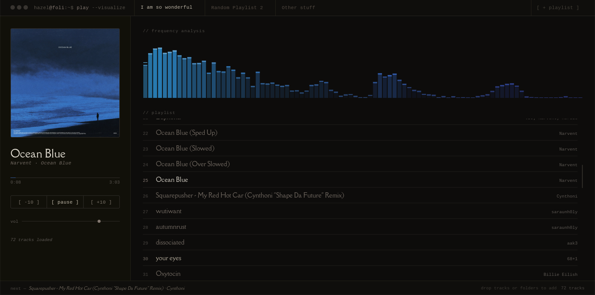

## foli

A local file player designed to look sexy, extremely minimal, and very awesome.

*The designing, font choices, colours, frontend, etc, is my own work. Claude is the one who coded it. I suck at coding, but I excel at design, therefore this is my workflow. Don't harrass me, please, I don't enjoy staring at code. Spare me. By the way this project uses* ***Vanilla HTML, CSS, and JS***

PS: This is explicitly for my own personal use, so I will NOT be taking contributions. **Do NOT contribute** or submit a PR to this project, if you want to change it, or make it your own, just *fork it* and commit heinous crimes with the codebase <3. Thank you for taking the time to read this.
  
  
  
## This project is open source under the Apache 2.0 License. 
Feel free to do whatever the fuck you want with it, just credit me somewhere. Please credit me.

The end-user is fully responsible for what music and or files they play.

made with love by *sentiensilencx*
